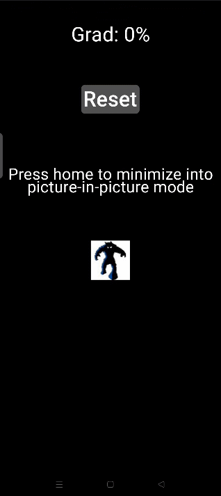

# Android EBike Utils

Displays gradient % on your Android Phone.

Has picture-in-picture mode - so you can overlay on your favourite VESC controller app.

Reset button - "Resets" the Grad to zero based on the current orientation of your phone.

## Status

Completely useless at the moment - needs filtering and cleaning up before it's a solid go to tool!

ToDo:  
1) Looks like crap - fixed sized PIP window e.t.c.
2) GPS Speed.
3) Checkboxes to Select Inclinometer or GPS Speed or Both

# Thoughts on Kotlin

With zero Kotlin or Android Studio knowledge, Took me 24 hours of faffing about to produce 240 lines of code to display a button, a line of text and read a Phone sensor. Feels like classic over-engineering a SDK into a bloated unwieldy mess :)
