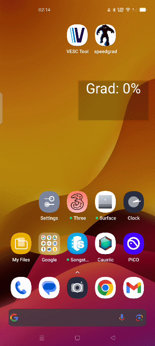

# Android EBike Utils

Displays gradient % on your Android Phone.

Has picture-in-picture mode - so you can overlay on your favourite VESC controller app.

Reset button - "Resets" the Grad to zero based on the current orientation of your phone.

ToDo:  
1) Looks like crap - fixed sized PIP window e.t.c.
2) GPS Speed.

